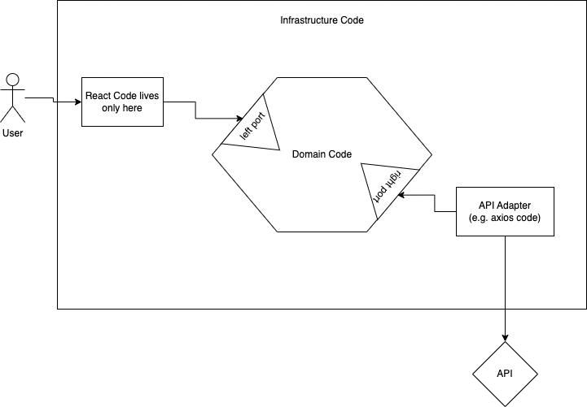

# Learning Hour: Hexagonal Architecture in Frontend

_(example applied to React framework)_

_Prerequisite: Practiced (learning hour for hexagonal architecture for backend)[https://github.com/tddfellow/learning-hour-hexagonal-architecture]._

## Hexagon on the frontend. Why?

Majority of frontend code can and should be considered UI part of the application. From the perspective
of the Ports & Adapters architecture, that should live outside the business domain part of the
application, which puts it in the infrastructure layer. And seemingly makes the architecture not very
applicable.

However, there are few points that suggest that Hexagonal Architecture is useful for frontend
development just as well:

1. There are external dependencies, and you want to protect the main body of your frontend application
   from changes in these, and enable you to swap out external services. Yes, your own backend service
   can be easily considered as such as well.
2. Frontend applications can have various amounts of business domain logic in them. Some applications
   have less and some have more. That logic needs to be protected from the infrastructure concerns.
   And infrastructure code should not be polluted by the business logic.
3. Sometimes, the frontend application is all you have (no backend), and all the business logic will
   live in that frontend codebase. In this scenario, the hexagonal architecture is vital.

## What is Right Port on the frontend?

Any external dependency with which your application logic or business logic needs to interact with
will be the Right Port in terms of Ports & Adapters architecture.

Here are some examples:

- Want to fetch data from the backend? Create the Right Port for this, and have the Adapter specify
  how exactly this data is accessed.
- Want to report a web analytics event? Create the Right Port for this.
- Want to access local storage? Create a port.
- Use external translations? — Port.
- 3rd-party API? — Port!

Usually, the name of the port and its methods will be about your business domain, and not even mention
what exactly is used. Let's take one example and try to come up with good names.

Let's say that you have Google Analytics installed, and you would like to push an event.

The port will be defined like this then:

```typescript
interface Analytics {
  sendEvent(event: EventEnum, extraData: EventData): Promise<void>;
}

enum EventEnum {
  MyEventOne,
  YourEventTwo,
}

interface EventData {
  // ... domain fields here ...
}
```

Few observations:

- It doesn't mention what kind of analytics is used in the background.
- It doesn't mention any types or implementation details of specific analytics used.
- It uses business domain types instead of using primitive strings or types from specific library.
- It's explicitly an asynchronous operation, because even if the currently chosen provider doesn't
  require that, some other provider we may want to switch to in the future might require async
  operation.

And then the implementation will actually be more specific to the chosen provider:

```typescript
class GoogleAnalytics implements Analytics {
  private events = {
    [EventEnum.MyEventOne]: "event-1",
    [EventEnum.YourEventTwo]: "event-2",
  };
  
  async sendEvent(event: EventEnum, extraData: EventData): Promise<void> {
    gtag("event", this.events[event], this.mapData(extraData));
  }
  
  private mapData(data: EventData): any {
    return {
      // ... mapping domain data to specific analytics data ...
    };
  }
}
```

## What is Left Port on the frontend?

Since the majority of React code (or any other UI framework) will be a View/UI concern only and not
business logic, then all this code must be in the infrastructure layer, on the left side from the
business domain.

That means that it should be interacting with said domain code via a Left Port. Additionally, this
means that you shouldn't have anything React-related beyond this point. So neither the domain code,
neither the infrastructure code on the right side of the domain should know anything about React.

Essentially, you should be able to throw away React, and implement simple JS+HTML UI or Vue, or any 
other framework for your domain code without modifying anything to the right side from it.

Here is a diagram:



How to actually implement this?

1. Put all react code into react components that are devoid of logic. Their job only to:
   1. Show stuff on screen, and trigger user actions via `Model` or `Service` patterns exposed
      through a Left Port interface.
   2. For complex views, return `ViewModel` pattern from the Left Port interface for the component
      to render without extra business logic.
2. Move all not-trivial business logic beyond the Left Port.

Note: state management can also be a good candidate for being part of the business domain logic,
unless it's a state of the UI element. If it's a state of the business use case, should be considered 
strongly handling that state outside of UI framework and in your business domain core.

Another very interesting peculiarity is that, for most applications, the Left Infrastructure side will 
have more code than the business domain core, as opposed to the backend application where the majority
of the code should live in the domain core. That's okay.

## Kata: Time Tracking

_Note: this kata should focus more on left port because that's more interesting with the frontend apps_

You have been tasked to implement an application for personal time tracking. Here are the use cases
that you need to support in the first version:

1. View all tasks available to you.
   
   This needs a backend API request, but for the purposes of this kata you should have a fake right 
   port adapter implementation returning a fake static response.

   Tasks that come from the backend have the following data each:

    ```json
    {
      "id": "unique-identifier",
      "title": "Task title",
      "createdAt": "YYYY-MM-DDTHH:MM:SS.sss",
      "isCurrent": true,
      "timeAllowanceInSeconds": 7200,
      "workUnits": [
        {
          "startedAt": "YYYY-MM-DDTHH:MM:SS.sss",
          "finishedAt": "YYYY-MM-DDTHH:MM:SS.sss"
        },
        {
          "startedAt": "YYYY-MM-DDTHH:MM:SS.sss",
          "finishedAt": null
        }
      ]
    }
    ```

2. As part of the view, you need to show the task title, the total duration spent, and how much is 
   left from the time allowance (field `timeAllowanceInSeconds`).
3. Ensure that the React component is a dumb view that is simply presenting the data, and have all the
   business logic and calculations in the domain core.
